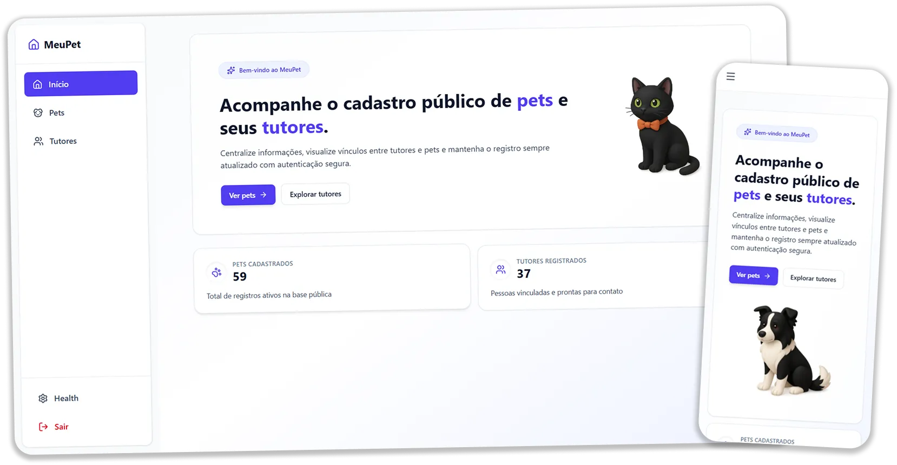

# Pet Front



SPA em React + TypeScript para o registro público de Pets e seus Tutores, consumindo a API pública do desafio.

## Sumário
- [Dados de inscrição](#dados-de-inscrição)
- [Vaga](#vaga)
- [Arquitetura](#arquitetura)
  - [Organização de pastas](#organização-de-pastas)
- [Funcionalidades principais](#funcionalidades-principais)
- [Requisitos](#requisitos)
- [Variáveis de Ambiente](#variáveis-de-ambiente)
- [Como utilizar a aplicação](#como-utilizar-a-aplicação)
- [Executando localmente](#executando-localmente)
  - [Build e preview](#build-e-preview)
  - [Testes](#testes)
  - [Lint](#lint)
- [Deploy](#deploy)
- [Executando container](#executando-container)
  - [Build da imagem](#build-da-imagem)
  - [Executar com Docker](#executar-com-docker)
  - [Executar com Docker Compose](#executar-com-docker-compose)
- [Recursos extras](#recursos-extras)

## Dados de inscrição
  Nome: Vinicius Rodrigues da Silva
  Email: viniciusrodriguess.dev@gmail.com
  CPF: 029.609.*** - **

## Vaga
- Cargo: Desenvolvedor(a) Front-End
- Senioridade: Senior

## Arquitetura
O projeto segue uma arquitetura em camadas com **Facade** e **Use Cases**, mantendo separação de responsabilidades.

**Camadas principais:**
- **domain**: entidades e contratos de repositórios.
- **application**: casos de uso e facades com estado via RxJS (`BehaviorSubject`).
- **infrastructure**: integração com API, HTTP client e storage de token.
- **presentation**: páginas, componentes, hooks e rotas (com lazy loading).
- **services**: composição de dependências (injeção simples).

**Fluxo:**
`presentation → services → application (facade/use-case) → domain (contracts) → infrastructure (API/HTTP)`

### Organização de pastas
- [src/presentation](src/presentation): UI, páginas e rotas.
- [src/application](src/application): facades e casos de uso.
- [src/domain](src/domain): entidades e interfaces.
- [src/infrastructure](src/infrastructure): API, HTTP, storage e repositórios.
- [src/services](src/services): composição das dependências.

## Funcionalidades principais
- Listagem e detalhe de pets com paginação e busca.
- CRUD de pets e tutores.
- Upload de fotos e vínculo pet ↔ tutor.
- Autenticação com refresh token.
- Página de health check.

## Requisitos
- Node.js 24 (LTS)
- PNPM 10

## Variáveis de Ambiente

O projeto utiliza variáveis de ambiente Vite para configuração da API. Crie um arquivo `.env` na raiz do projeto com as seguintes variáveis:

```env
VITE_API_URL=https://pet-manager-api.geia.vip
```

Um exemplo de configuração está disponível em `.env.example`. As variáveis de ambiente começadas com `VITE_` são automaticamente expostas no código do cliente durante o build.

## Como utilizar a aplicação:

Existem 3 formas de testar: 
- Executando localmente
- Executando container
- Acessando https://meu-pet-app.vercel.app

Abaixo eu deixo explicado como executar o projeto localmente das duas formas

## Executando localmente
```bash
pnpm install
pnpm dev
```

A aplicação será iniciada em `http://localhost:5173` (porta padrão do Vite).

### Build e preview
```bash
pnpm build
pnpm preview
```

### Testes
```bash
pnpm test
pnpm test:coverage
```

### Lint
```bash
pnpm lint
```

## Deploy
O build gera arquivos estáticos em `dist/`, compatíveis com qualquer static hosting (Vercel, Netlify, S3, etc.).

Fluxo sugerido:
1. `pnpm build`
2. Publicar o diretório `dist/`

## Executando container
Este repositório inclui um `Dockerfile` multi-stage para empacotar o build estático.

### Build da imagem

Por padrão, o build utiliza a API em `https://pet-manager-api.geia.vip`:

```bash
docker build -t pet-front:latest .
```

Para usar uma URL diferente da API, passe o argumento `VITE_API_URL`:

```bash
docker build --build-arg VITE_API_URL=https://outra-api.com -t pet-front:latest .
```

### Executar com Docker

```bash
docker run --rm -p 8080:80 pet-front:latest
```

A aplicação ficará disponível em `http://localhost:8080`.

### Executar com Docker Compose

```bash
# Usa a variável VITE_API_URL do arquivo .env
docker-compose up --build
```

Você pode sobrescrever a variável ao executar:

```bash
VITE_API_URL=https://outra-api.com docker-compose up --build
```

O container expõe a porta `3000` por padrão (configurável em `docker-compose.yml`).

## Recursos extras

Tomei a liberdade de ampliar o escopo do projeto adicionando funcionalidades não obrigatórias. Segue abaixo uma lista das melhorias feitas:

- Página inicial com contador de Pets e Tutores;
- Loadings animados
- Vincular multiplos pets de uma vez
- Página 404
- Regras de validação dos inputs
  - Validação de CPF
  - Validação de Email
  - Tamanhos mínimos e máximos para alguns textos
- Build multi-stage no docker
- Eslint